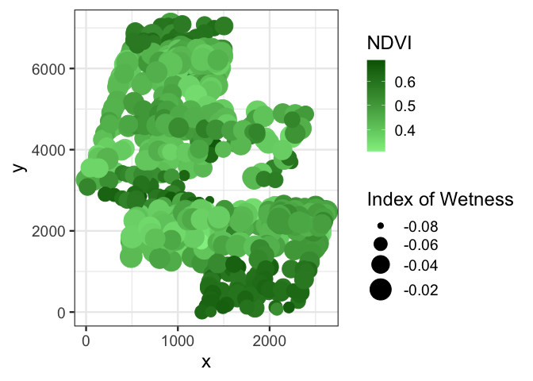
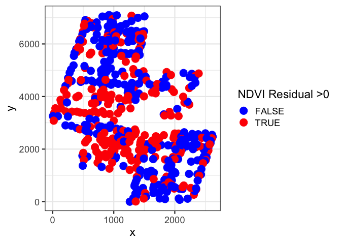

**Correcting Standard Errors in SEMs fit with Covariance Matrices and ML
using Moran’s I**

This code addresses the problem of correcting sample sizes and standard
errors in the presence of spatial autocorrelation in Structural Equation
Models with with spatial structure in the autocorrelation of endogenous
variables. Two file are included. The first, ndvi\_se\_corrected.R,
walks through the steps to calculate corrections piece by piece. You can
see a longer explanation at <http://www.imachordata.com/?p=1714>

The second is a function that impelements the correction for all
endogenous variables, using Moran’s I and an approximation of an
effective sample size for large sample sizes.

For an example, consuder the Boreal Vegetation dataset from Zuur et
al.’s [Mixed Effects Models and Extensions in Ecology with
R](http://www.highstat.com/book2.htm). The data shows vegetation NDVI
from satellite data, as well as a number of other covariates -
information on climate (days where the temperature passed some
threshold, I believe), wetness, and species richness. And space. Here’s
what the data look like, for example:

    # Boreality data from http://www.highstat.com/book2.htm
    # Mixed Effects Models and Extensions in Ecology with R (2009). 
    # Zuur, Ieno, Walker, Saveliev and Smith. Springer
    boreal <- read.table("./Boreality.txt", header=T)

    #For later
    source("./lavSpatialCorrect.R")
    source("./lavResidualsY.R")

    #Let's look at the spatial structure
    library(ggplot2)

    qplot(x, y, data=boreal, size=Wet, color=NDVI) +
      theme_bw(base_size=18) + 
      scale_size_continuous("Index of Wetness", range=c(0,10)) + 
      scale_color_gradient("NDVI", low="lightgreen", high="darkgreen")

    ## Warning: `qplot()` was deprecated in ggplot2 3.4.0.
    ## This warning is displayed once every 8 hours.
    ## Call `lifecycle::last_lifecycle_warnings()` to see where this warning was
    ## generated.

We can fit a model using [lavaan](http://lavaan.org) where NDVI is
affected by species richness (nTot), wetness (Wet), and climate (T61)
and richness is itself also affected by climate.

    library(lavaan)

    ## This is lavaan 0.6-14
    ## lavaan is FREE software! Please report any bugs.

    # A simple model where NDVI is determined
    # by nTot, temperature, and Wetness
    # and nTot is related to temperature
    borModel <- '
      NDVI ~ nTot + T61 + Wet 
      nTot ~ T61
    '

    #note meanstructure=T to obtain intercepts
    borFit <- sem(borModel, data=boreal, meanstructure=T)

However, the residuals show autocorrelation. One way to see this is just
to look at the spatial pattern of the signs of residuals.

    # residuals are key for the analysis
    borRes <- lavResidualsY(borFit)

    #raw visualization of NDVI residuals
    qplot(x, y, data=boreal, color=borRes$NDVI, size=I(5)) +
      theme_bw(base_size=17) + 
      scale_color_gradient("NDVI Residual", low="blue", high="yellow")

    #raw visualization of sign of residuals
    qplot(x, y, data=boreal, color=borRes$NDVI>0, size=I(5)) +
      theme_bw(base_size=17) + 
      scale_color_manual("NDVI Residual >0", values=c("blue", "red"))

lavSpatialCorrect calculates Moran’s I for the residuals of all
endogenous variables, and then spatially corrects them via Moran’s I. If
they are spatially independent, the effective sample size = the true
sample size.

    lavSpatialCorrect(borFit, boreal$x, boreal$y)

    ## Loading required package: ape

    ## $Morans_I
    ## $Morans_I$NDVI
    ##     observed     expected         sd p.value    n.eff
    ## 1 0.08235969 -0.001879699 0.00398581       0 451.8852
    ## 
    ## $Morans_I$nTot
    ##     observed     expected          sd p.value    n.eff
    ## 1 0.03853411 -0.001879699 0.003998414       0 493.4468
    ## 
    ## 
    ## $parameters
    ## $parameters$NDVI
    ##             Parameter      Estimate    n.eff      Std.err    Z-value
    ## NDVI~nTot   NDVI~nTot -0.0003567484 451.8852 0.0001848323  -1.930119
    ## NDVI~T61     NDVI~T61 -0.0354776273 451.8852 0.0024486246 -14.488798
    ## NDVI~Wet     NDVI~Wet -4.2700526409 451.8852 0.1435982476 -29.736106
    ## NDVI~~NDVI NDVI~~NDVI  0.0017298286 451.8852 0.0001150811  15.031387
    ## NDVI~1         NDVI~1 10.8696158605 451.8852 0.7266649329  14.958223
    ##                  P(>|z|)
    ## NDVI~nTot   5.359211e-02
    ## NDVI~T61    1.426164e-47
    ## NDVI~Wet   2.622798e-194
    ## NDVI~~NDVI  4.573319e-51
    ## NDVI~1      1.376535e-50
    ## 
    ## $parameters$nTot
    ##             Parameter    Estimate    n.eff     Std.err   Z-value      P(>|z|)
    ## nTot~T61     nTot~T61    1.170661 493.4468   0.5674087  2.063171 3.909634e-02
    ## nTot~~nTot nTot~~nTot  112.051871 493.4468   7.1336853 15.707431 1.345205e-55
    ## nTot~1         nTot~1 -322.936930 493.4468 168.1495919 -1.920534 5.479054e-02
